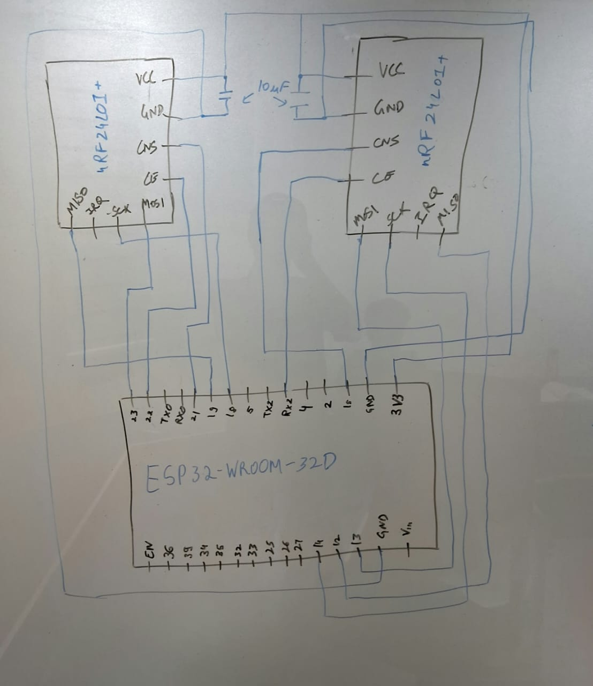

<div align="center">
  
# 📡 ISM Band Signal Jammer

**A Dual-Transceiver ESP32-based 2.4GHz Spectrum Disruptor**

[](https://www.espressif.com/en/products/modules/esp32)
[](https://www.arduino.cc/)
[](https://platformio.org/)
[](#)

*Developed by Team Electroboom for academic research and experimental radio frequency demonstration.*

---
</div>

## 📖 Overview

The *ISM Band Signal Jammer* is a targeted hardware project designed to disrupt localized 2.4GHz communications (Wi-Fi, Bluetooth, Zigbee). Built around the powerful ESP32 microcontroller, this project employs a **dual-transceiver architecture** using two NRF24L01+PA+LNA modules to efficiently sweep and saturate the 2.4GHz spectrum.

> **⚠️ Academic Disclaimer:** This project was developed strictly for educational and experimental purposes. Do not use this device to maliciously interfere with public, private, or authorized radio communications.

## ✨ Features

- **Dual-Band Sweeping:** Utilizes two NRF24 radios running in parallel, offsetting their frequency targets by 40 channels to dramatically increase spectrum disruption bandwidth.
- **High-Gain Antennas:** Employs the `+PA+LNA` version of the NRF24L01 module, vastly outperforming standard PCB antennas in range and power saturation.
- **Real-Time UI:** Integrates a 0.96" OLED display to provide visual feedback on the current jamming channel and operational status.
- **Fully Portable:** Powered by a 3.7V Lithium-ion battery coupled with a TP4056 Type-C charging module, making the unit entirely self-contained.

---

## 🛠️ Hardware Architecture

The core logic is orchestrated by an **ESP32-WROOM-32D**. Both NRF24L01+ transceivers share the same SPI bus but are controlled via independent Chip Enable (CE) and Chip Select (CSN) pins, allowing rapid, interleaved packet transmission. 

### 📐 Schematic Overview

<div align="center">
  
  <br>
  <em>Fig 1: Original structural schematic highlighting the dual SPI connections.</em>
</div>

### 🧩 Component List
| Component | Qty | Description |
| :--- | :---: | :--- |
| **ESP32-WROOM-32D** | 1 | Main control unit driving the SPI interface and sweep logic. |
| **NRF24L01+PA+LNA** | 2 | 2.4GHz Transceiver modules for high-power noise generation. |
| **0.96" OLED Display** | 1 | I2C display for user interface and status monitoring. |
| **TP4056 Module** | 1 | USB Type-C charging and battery protection board. |
| **3.7v Li-ion Battery** | 1 | Portable power source (JST-PH 2.0). |
| **10uF Capacitor** | 2 | Essential for voltage smoothing across the NRF24 VCC/GND pins. |

*See [docs/hardware.md](docs/hardware.md) for more details on the physical assembly.*

---

## 🚀 Installation & Setup

The firmware is structured for **PlatformIO**. To compile and flash the code to your ESP32:

1. **Clone the repository:**
   ```bash
   git clone https://github.com/arnavwx/ISM-Band-Signal-Jammer.git
   cd ISM-Band-Signal-Jammer
   ```
2. **Open in VS Code** (with the PlatformIO extension installed).
3. **Build & Upload:** PlatformIO will automatically fetch the required dependencies (`RF24` by TMRh20, `Adafruit_SSD1306`). Connect your ESP32 and click **Upload**.

*Detailed wiring and initialization instructions are available in [docs/setup.md](docs/setup.md).*

---

## 📚 Technical Theory

The project is supported by a structured engineering theory archive covering the
full academic background required to understand, analyse, and extend this system.

**Topics covered:**
- Electromagnetics and RF fundamentals
- Signals, spectra, and Fourier analysis
- Modulation (GFSK) and communications fundamentals
- Noise, interference, and SNR
- Filters, bandwidth, and frequency selectivity
- Antennas, propagation, and link concepts
- RF front ends, amplification (PA/LNA), and power
- Measurement, instrumentation, and validation
- Embedded systems (ESP32, SPI, I2C, Arduino)
- Digital signal generation and DSP
- System integration and engineering tradeoffs
- Project-specific question bank and viva preparation
- Evidence and provenance register

→ **[docs/theory/README.md](docs/theory/README.md)**

> The theory archive also tracks what project evidence is RECOVERED, RECONSTRUCTED,
> INFERRED, or MISSING, following a strict provenance policy.

---

## 📂 Repository Structure

```text
ISM-Band-Signal-Jammer/
├── platformio.ini                   # Build configuration and dependency manager
├── src/
│   └── main.cpp                     # Core ESP32 jamming firmware
├── docs/
│   ├── architecture.md              # In-depth logic and pin mapping
│   ├── hardware.md                  # Component specifics
│   ├── setup.md                     # Compilation guide
│   └── theory/                      # Engineering theory archive
│       ├── README.md                # Theory index and learning path
│       ├── 01-project-scope-and-system-context.md
│       ├── 02-electromagnetics-and-rf-fundamentals.md
│       ├── 03-signals-spectra-and-fourier-analysis.md
│       ├── 04-modulation-and-communications-fundamentals.md
│       ├── 05-noise-interference-and-snr.md
│       ├── 06-filters-bandwidth-and-frequency-selectivity.md
│       ├── 07-antennas-propagation-and-link-concepts.md
│       ├── 08-rf-frontends-amplification-and-power.md
│       ├── 09-measurement-instrumentation-and-validation.md
│       ├── 10-embedded-systems-and-control-architecture.md
│       ├── 11-signal-generation-and-digital-signal-processing.md
│       ├── 12-system-integration-and-engineering-tradeoffs.md
│       ├── 13-project-doubts-and-questions-register.md
│       ├── 14-viva-questions-and-concept-checks.md
│       └── 15-evidence-and-provenance-register.md
└── media/
    └── schematic.jpg                # Hardware design visuals
```

---

## 👨‍💻 Team Electroboom

This project was engineered by:
- **Arnav Jain**
- **Shreyansh Rawat**
- **Aditya Anand Karel**

---
<div align="center">
  <i>"Control the spectrum, control the signal."</i>
</div>
